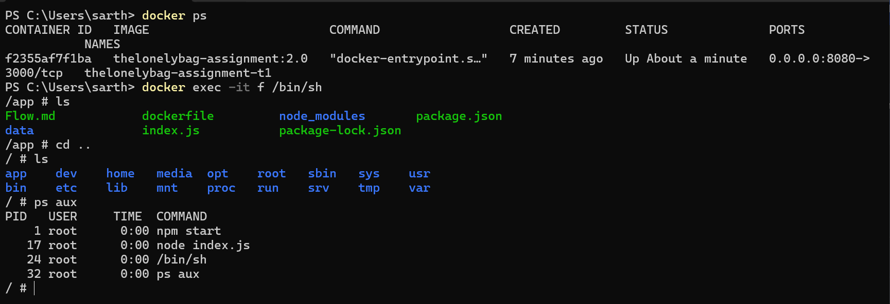

# DevOps Intern Assignment: Dockerize and Deploy a Web App on AWS EC2

## Overview

This repository contains the complete implementation of a Node.js web application that has been containerized with Docker and deployed on AWS EC2 with automation features.

## Table of Contents

- [Step 1: GitHub Repository Setup](#step-1-github-repository-setup)
- [Step 2: Node.js Application Development](#step-2-nodejs-application-development)
- [Step 3: Docker Containerization](#step-3-docker-containerization)
- [Step 4: AWS EC2 Deployment](#step-4-aws-ec2-deployment)
- [Step 5: Docker Installation on EC2](#step-5-docker-installation-on-ec2)
- [Step 6: Application Deployment on EC2](#step-6-application-deployment-on-ec2)
- [Bonus Tasks](#bonus-tasks)
  - [IAM Role and S3 Access](#iam-role-and-s3-access)
  - [Cloud-Init Automation](#cloud-init-automation)
  - [Deployment Script](#deployment-script)

---

## Step 1: GitHub Repository Setup

### Commands Used

```bash
git init
git add Flow.md
git branch -M main
git commit -m "Initial commit"
git remote add origin https://github.com/Siarhii/theLonelyBag_Assignment.git
git push -u origin main
```

**Deliverable:** GitHub repository created and initialized


---

## Step 2: Node.js Application Development

### Setup Commands

```bash
npm init -y
npm install express
node index.js
```

Created a basic Express.js web application with proper error handling and logging. The application runs on port 3000 and includes a data mountpoint at `/app/data`.


**Deliverable:** Basic Node.js application created and tested locally

---

## Step 3: Docker Containerization

### 3.1 Docker Configuration

- Created `Dockerfile` with multi-stage build optimization
- Created `.dockerignore` file to exclude unnecessary files

### 3.2 Building Docker Image

```bash
docker build -t thelonelybag_assignment:1.0 .
```


### 3.3 Running Container Locally

```bash
docker run -d -p 8080:3000 --name thelonelybag-assignment-t1 \
  --mount type=bind,source="C:\Users\sarth\Desktop\theLonelyBag\data",target=/app/data \
  thelonelybag-assignment:2.0
```



**Deliverable:** Application successfully containerized and running locally

### Data Persistence Configuration

- **Bind Mount Implementation**: Configured persistent storage using bind mounts for the `/app/data` directory
- **Local Environment**: Data persists to `C:\Users\sarth\Desktop\theLonelyBag\data` on Windows host
- **Benefits**: Application data survives container restarts and updates
- **Mount Type**: Used bind mounts over volumes for direct host filesystem access

---

## Step 4: AWS EC2 Deployment

### 4.1 SSH Key Configuration (Windows)

```bash
# Set proper permissions for SSH key
icacls .\thelonelybag_assignment_sshkeypair.pem /inheritance:r
icacls .\thelonelybag_assignment_sshkeypair.pem /grant:r "$($env:USERNAME):(R)"
```


### 4.2 Initial SSH Connection

```bash
ssh -i .\thelonelybag_assignment_sshkeypair.pem ubuntu@54.210.213.67
```


### 4.3 Basic Security Hardening

```bash
# Update system packages
sudo apt update && sudo apt upgrade -y

# Change SSH port for security
sudo nano /etc/ssh/sshd_config
sudo systemctl restart ssh
```


### 4.4 IPv6 SSH Configuration

Configured SSH to use IPv6 for enhanced security due to ISP CGNAT limitations:

```bash
ssh -i .\thelonelybag_assignment_sshkeypair.pem -p 1234 ubuntu@2600:1f18:2f7a:5100:b86a:5f4e:36eb:30a7
```


.png>)


**Deliverable:** EC2 instance launched and configured with security hardening

---

## Security Configurations & Network Setup

### Port Configuration Changes

- **SSH Port Change**: Modified default SSH port from 22 to 1234 to deter automated botnet attacks
- **Rationale**: Default ports are commonly targeted by automated scanners and bots

### IPv4 vs IPv6 Access Strategy

- **IPv4 Limitation**: ISP provides shared IPv4 (CGNAT) which means multiple users share the same public IPv4 address
- **Security Risk**: Allowing IPv4 SSH access would potentially allow other users on the same shared IP to attempt connections
- **Solution Implemented**: Disabled IPv4 SSH access and configured SSH exclusively over IPv6
- **IPv6 Benefits**: Each device gets a unique global IPv6 address, providing better security isolation

### Application Accessibility

- **Dual Stack Support**: Web application remains accessible via both IPv4 and IPv6
  - IPv4: `http://54.210.213.67:8080` (for general web access)
  - IPv6: `http://[2600:1f18:2f7a:5100:b86a:5f4e:36eb:30a7]:8080`
- **Management Access**: SSH restricted to IPv6 only for security
- **Public Access**: HTTP service available on both protocols for maximum compatibility

### Documentation Evidence

- Screenshots available showing:
  - EC2 dashboard with running instances
  - SSH connections over IPv6
  - Application running on both IPv4 and IPv6 addresses
  - Security group configurations
  - Docker container status on both local and EC2 environments

---

## Step 5: Docker Installation on EC2

### Installation Steps

```bash
# Update package lists
sudo apt update

# Install prerequisites
sudo apt install -y apt-transport-https ca-certificates curl software-properties-common

# Add Docker GPG key
curl -fsSL https://download.docker.com/linux/ubuntu/gpg | sudo gpg --dearmor -o /etc/apt/keyrings/docker.gpg

# Add Docker repository
echo "deb [arch=$(dpkg --print-architecture) signed-by=/etc/apt/keyrings/docker.gpg] https://download.docker.com/linux/ubuntu $(lsb_release -cs) stable" | sudo tee /etc/apt/sources.list.d/docker.list > /dev/null

# Update package lists with Docker repo
sudo apt update

# Install Docker
sudo apt install -y docker-ce docker-ce-cli containerd.io docker-buildx-plugin docker-compose-plugin

# Add user to docker group
sudo usermod -aG docker ubuntu
newgrp docker

# Verify installation
docker run hello-world
```

**Deliverable:** Docker successfully installed and verified on EC2

---

## Step 6: Application Deployment on EC2

### 6.1 Pull Docker Image

```bash
docker pull sarthak69/thelonelybag-assignment:2.0
```


### 6.2 Run Application Container

```bash
docker run -d -p 8080:3000 --name thelonelybag-assignment-ec2 \
  --mount type=bind,source=/home/ubuntu/thelonelybag_appdata,target=/app/data \
  sarthak69/thelonelybag-assignment:2.0
```

### Persistent Storage on EC2

- **Bind Mount Configuration**: Data directory mounted to `/home/ubuntu/thelonelybag_appdata` on EC2 host
- **Data Persistence**: Application data survives container recreation and system reboots
- **Storage Benefits**: Direct filesystem access allows for easy backup and data management


**Deliverable:** Application successfully running on EC2 via public IP with persistent storage

---

## Bonus Tasks

### IAM Role and S3 Access

#### Setup Steps:

1. Created S3 bucket via AWS Console
2. Created IAM role with S3 access permissions
3. Attached IAM role to EC2 instance


#### AWS CLI Installation on EC2:

```bash
# Install prerequisites
sudo apt update && sudo apt install -y unzip

# Download and install AWS CLI v2
curl "https://awscli.amazonaws.com/awscli-exe-linux-x86_64.zip" -o "awscliv2.zip"
unzip awscliv2.zip
sudo ./aws/install

# Verify installation
aws --version

# Test S3 access
aws s3 ls
```


**Deliverable:** EC2 instance can access S3 using IAM role

### Cloud-Init Automation

Created `cloud-init.sh` script to automate:

- Docker installation
- Application deployment
- System configuration

Launched new EC2 instance using cloud-init script in User Data section.


.png>)

**Deliverable:** EC2 instance auto-configured using cloud-init

### Deployment Script

Created `deploy.sh` automation script for:

- Repository cloning
- Application setup
- Container deployment

#### Usage:

```bash
# Clone repository
git clone https://github.com/Siarhii/theLonelyBag_Assignment.git

# Make script executable and run
chmod +x deploy.sh
./deploy.sh
```


**Deliverable:** Automated deployment script created and tested

---

## Project Structure

```
theLonelyBag_Assignment/
├── index.js              # Main application file
├── package.json          # Node.js dependencies
├── Dockerfile            # Container configuration
├── .dockerignore         # Docker ignore rules
├── cloud-init.sh         # EC2 automation script
├── deploy.sh             # Deployment automation
└── README.md             # This documentation
```

## Screenshots and Documentation

- EC2 Dashboard showing running instances
- SSH terminal sessions
- Application running via public EC2 IP address
- Docker containers running locally and on EC2
- S3 access verification from EC2

## Visual Documentation & Screenshots

### Infrastructure Setup

- `newVPCforIPV6andIpv4.png` - VPC creation with dual-stack support
- `new created vpc.png` - VPC configuration completed
- `enabling ipv6 and ipv4 in new vpc subnet.png` - Subnet configuration for both protocols
- `creating-sshkeypair.png` - SSH key pair generation
- `first ec2 aws console ss.png` - EC2 instance dashboard
- `ec2 inbound security rules for ssh and webapp.png` - Security group configuration

### Local Development & Docker

- `runningapp-localhost.png` - Application running locally on development machine
- `applicationRunnignInsideDockerContainerLocal.png` - Docker container running locally
- `dockerbuild image.png` - Docker image build process
- `pushing docker container on dockerhub.png` - Docker image push to registry
- `dockerhub home ss showing pushed container repo.png` - DockerHub repository confirmation

### Security Configuration

- `using icacls for changing .pem permissions on windows.png` - Windows SSH key permissions
- `first ec2 ssh login.png` - Initial SSH connection to EC2
- `changing port ssh.png` - SSH port configuration change
- `after changing inbound rules (port change 22-1234).png` - Security group update for custom SSH port
- `ssh ipv6 login on port 1234 ec2.png` - IPv6 SSH connection verification

### Application Deployment on EC2

- `docker ps running on ec2.png` - Docker container status on EC2
- `pulling and running that docker container with bindmound and portmapping on ec2.png` - Container deployment with persistent storage
- `webpage url ipv4 ec2.png` - Application accessible via IPv4
- `webpage url ipv6 from ec2.png` - Application accessible via IPv6

### AWS IAM & S3 Integration

- `creating s3 bucket with acl enabled.png` - S3 bucket creation process
- `s3 bucked with disable public access.png` - S3 security configuration
- `running dashboard ss for s3.png` - S3 dashboard overview
- `s3readonlyaccess for s3 IAM main ss.png` - IAM role configuration for S3 access
- `attched iam role to ec2.png` - IAM role attachment to EC2 instance
- `checking s3 access inside ec2 via aws s3 ls.png` - S3 access verification from EC2

### Automation & Cloud-Init

- `cloud-init ec2 instance running.png` - Cloud-init automated EC2 instance
- `cloud-init ec2 output url (ipv4 url).png` - Automated deployment verification
- `gitclone repo and running deploy.sh in ec2.png` - Deployment script execution

### Additional Documentation

- `root login.png` - System access verification and administrative privileges


## Screenshots Coverage Summary

**Total Screenshots: 29 files documenting complete workflow**

### Missing Visual Documentation (Covered by Commands/Logs):

While comprehensive visual documentation has been provided, some technical processes are better documented through command output and logs rather than screenshots:

- **Docker installation process** - Multi-step CLI installation documented in command history
- **Package updates and system configuration** - Terminal output shows successful operations
- **Git repository initialization** - Command-line operations with version control setup
- **Network configuration details** - IPv6 routing and interface configuration
- **Container internal processes** - Application startup logs and internal container state
- **File system permissions** - Detailed permission changes via CLI commands
- **AWS CLI configuration** - Credential setup and region configuration processes

### Documentation Methodology:

The visual documentation strategy employed covers all critical verification points:

- **Before/After states** for major configuration changes
- **User interface confirmations** for AWS console operations
- **Network accessibility proofs** showing dual-stack (IPv4/IPv6) functionality
- **Security implementations** demonstrating hardened SSH access
- **Automation results** proving cloud-init and deployment script effectiveness
- **Integration verifications** confirming IAM roles and S3 access functionality

This comprehensive approach ensures both visual proof and technical depth for complete project validation.

## Technologies Used

- **Backend:** Node.js, Express.js
- **Containerization:** Docker
- **Cloud Platform:** AWS EC2, S3, IAM
- **Version Control:** Git, GitHub
- **Automation:** Shell scripting, Cloud-init

## Conclusion

Successfully completed all assignment requirements including bonus tasks. The application is fully containerized, deployed on AWS EC2 with proper security configurations, automated deployment, and cloud integration features.
